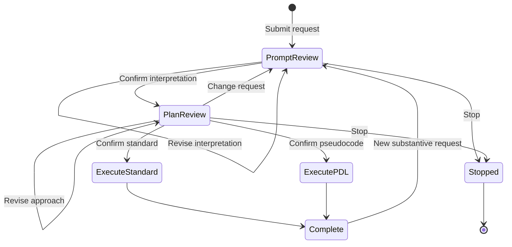

# ADR-0001: Adopt a controller-gated pseudocode protocol

- Status: Accepted
- Date: 2026-08-06
- Owners: PDL protocol maintainers
- Related: [Technical requirements](../trd/0001-controller-gated-pseudocode-protocol.md)

## Related decisions

This umbrella decision is refined by:

- [ADR-0002: Use controller-owned artifact controls](0002-controller-owned-artifact-controls.md)
- [ADR-0003: Use phase-projected single-model contexts](0003-phase-projected-single-model-contexts.md)
- [ADR-0004: Make confirmed artifacts the clean execution boundary](0004-confirmed-artifacts-as-execution-boundary.md)
- [ADR-0005: Support optional Result Pseudocode](0005-optional-result-pseudocode.md)
- [ADR-0006: Bound pre-execution reasoning and material guessing](0006-bounded-pre-execution-reasoning.md)

## Context

The current `confirm-with-pseudocode` skill implements a two-stage interaction:

1. Confirm Prompt Pseudocode describing what the user wants.
2. Confirm Response Plan Pseudocode describing how the model will respond.
3. Execute the confirmed specification.

This separation is valuable. Prompt interpretation and response planning have
different objectives and should not be collapsed. The confirmed artifacts also
reduce anchoring, contradictory instructions, and contamination from rejected
drafts when they become the authoritative execution specification.

The skill-only implementation nevertheless places responsibilities in the
model that a host can perform more reliably:

- protocol state is inferred from conversational history;
- confirmations and corrections are natural-language turns;
- deterministic branches depend on model classification;
- the complete skill instructions remain in model context after activation;
- rejected drafts and confirmation chatter can remain visible during execution;
- alternate execution modes cannot be selected as explicit controller events;
- the final result cannot be retained as an optional pseudocode artifact.

Subagent handoffs could isolate the phases, but they are not required for the
core architecture. A single model can perform all phases if a host controller
owns state and supplies a separate, phase-appropriate context for each call.

## Decision drivers

- Preserve the semantic fidelity of Prompt Pseudocode.
- Preserve the non-anchoring abstraction of Response Plan Pseudocode.
- Make branching deterministic and visible to the user.
- Reduce model-visible protocol overhead and conversational context pollution.
- Support standard responses and substantive Result Pseudocode.
- Preserve complete task context without forwarding the complete transcript.
- Keep the Cal Poly PDL conventions as the only user-visible pseudocode basis.
- Permit future model routing without making subagents part of the protocol.

## Decision

Adopt a deterministic host-controlled state machine for the pseudocode
confirmation protocol.

The controller, rather than the model, owns:

- protocol state and permitted transitions;
- artifact identifiers, versions, and confirmation status;
- user-interface actions;
- canonical task inputs and source references;
- phase-specific context construction;
- selected execution-output mode;
- exclusion of rejected or obsolete artifacts from later phases.

The model owns:

- generation and complete regeneration of Prompt Pseudocode;
- generation and complete regeneration of Response Plan Pseudocode;
- execution of the confirmed specification;
- generation of Result Pseudocode when that output mode is selected.

The initial implementation may use one model for all phases. Each phase is a
separate inference with a controller-compiled context. Model identity does not
serve as workflow state, and no hidden model state is assumed to persist across
calls.

### Artifact roles

1. **Prompt Pseudocode** is the authoritative semantic task specification. It
   maximizes useful semantic specificity and contains no response strategy or
   substantive answer.
2. **Response Plan Pseudocode** is the authoritative high-level approach. It
   uses the minimum sufficient procedural specificity and contains no predicted
   findings or answer.
3. **Result Pseudocode** is an optional substantive result format selected at
   plan confirmation. It may contain conclusions, resolved values, decisions,
   or produced procedures because execution has occurred. It is not another
   response plan.

All three artifacts use the local condensed Cal Poly PDL conventions. The
controller may use ordinary internal records or schemas, but it must not expose
a replacement pseudocode DSL.

### User-visible flow

Prompt review provides **Confirm interpretation**, **Revise interpretation**,
and **Stop**. Plan review provides **Confirm standard**, **Confirm pseudocode**,
**Revise approach**, **Change request**, and **Stop**.

`Confirm pseudocode` selects a rendering mode for the already-confirmed task;
it does not authorize a semantic change. A content, scope, audience, or output
requirement change returns to Prompt review.

### Context boundary

The controller keeps canonical task state outside the model transcript and
constructs a minimum sufficient context for each phase.

Execution receives:

- confirmed Prompt Pseudocode;
- confirmed Response Plan Pseudocode;
- required task inputs and source material;
- selected output mode;
- applicable higher-priority safety and platform instructions.

Execution excludes:

- rejected artifact versions;
- correction and confirmation chatter;
- protocol instructions used only by earlier phases;
- obsolete plans;
- private reasoning or hidden chain-of-thought.

## Consequences

### Positive

- State transitions are deterministic, testable, and independent of wording.
- Users confirm through explicit controls instead of magic phrases.
- The main execution context contains fewer competing instructions.
- Rejected interpretations and premature plans cannot anchor execution.
- Phase prompts and the PDL reference can be independently cached and tuned.
- Standard and PDL result modes become valid, explicit deviations.
- Prompt, Plan, and Result triples can support replay, evaluation, dry runs,
  continuation, and selectively retrieved few-shot examples.
- A future implementation may route phases to different models without
  changing the user-visible protocol.

### Negative

- The host must persist canonical state and artifact versions.
- UI and controller implementation are more complex than an instruction-only
  skill.
- Phase isolation can become lossy if the controller constructs incomplete
  contexts.
- Result Pseudocode is not the best representation for every task and must
  remain optional.
- Confirmation fatigue remains possible if the protocol is applied to every
  low-risk request.

## Risks and mitigations

| Risk | Mitigation |
|---|---|
| A confirmed Prompt Pseudocode omits a requirement | Validate coverage against the current authoritative request and make revision easy. |
| The plan contains predicted conclusions | Run plan-poisoning checks and regenerate before display. |
| The controller drops required source context | Maintain canonical source inputs separately and test every phase projection. |
| A stale UI action confirms an obsolete artifact | Require artifact ID and version on every event. |
| Users confirm without reading | Use persistent, readable artifact cards and support strict, adaptive, and off activation policies. |
| Result Pseudocode distorts a nonprocedural answer | Keep it opt-in and preserve the requested substantive content over forced algorithmic form. |
| Untrusted task inputs contain prompt injection | Keep normal safety and source-trust controls; protocol isolation is not an injection defense by itself. |

## Alternatives considered

### Keep the skill-only protocol

Rejected as the target architecture. It remains a useful behavioral reference
and fallback, but it cannot guarantee deterministic UI branching or isolated
phase contexts.

### Use three mandatory agents

Deferred as a future optimization. Interpreter, planner, and executor agents
provide strong isolation but add orchestration prompts, handoff contracts, and
potential cross-model translation loss. The protocol does not require them.

### Combine interpretation and planning

Rejected. A single artifact prevents the user from correcting task meaning
without also accepting or influencing a response strategy.

### Generate only natural-language final responses

Rejected as an exclusive design. Natural-language output remains the default,
but Result Pseudocode is valuable as a reusable intermediate representation and
continuation artifact.

## Scope and deferred decisions

This decision defines product behavior and controller boundaries. It does not
select a host SDK, storage engine, concrete model, or UI framework. Model
routing, subagent use, training, and model-weight changes are future concerns.
