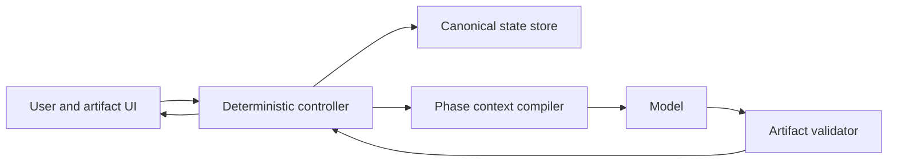

# TRD-0001: Controller-gated pseudocode protocol

- Status: Draft for implementation
- Version: 0.1
- Date: 2026-08-06
- Governing decisions:
  - [ADR-0001: Controller-gated protocol](../adr/0001-controller-gated-pseudocode-protocol.md)
  - [ADR-0002: Controller-owned artifact controls](../adr/0002-controller-owned-artifact-controls.md)
  - [ADR-0003: Phase-projected single-model contexts](../adr/0003-phase-projected-single-model-contexts.md)
  - [ADR-0004: Confirmed artifacts as execution boundary](../adr/0004-confirmed-artifacts-as-execution-boundary.md)
  - [ADR-0005: Optional Result Pseudocode](../adr/0005-optional-result-pseudocode.md)
  - [ADR-0006: Bounded pre-execution reasoning](../adr/0006-bounded-pre-execution-reasoning.md)
- Existing behavioral reference: [`confirm-with-pseudocode`](../../../confirm-with-pseudocode/SKILL.md)
- PDL reference: [PDL compatibility conventions](../../../confirm-with-pseudocode/references/pdl-conventions.md)
- Skill evaluation: [Scoped evaluation results](../../evaluation/results.md)

## 1. Purpose

Specify a host-controlled implementation of the confirmed-pseudocode workflow.
The implementation SHALL preserve separate confirmation of task meaning and
response approach while allowing one model to perform all generation and
execution phases with phase-specific context.

The controller SHALL support two execution-output modes:

- a standard final response;
- a substantive final response expressed as Result Pseudocode.

## 2. Goals

1. Make every protocol transition deterministic.
2. Remove confirmation phrasing and protocol branching from model reasoning.
3. Preserve all canonical task inputs outside transient model contexts.
4. Minimize the context supplied to each phase without losing required facts.
5. Prevent rejected artifacts and premature conclusions from influencing
   execution.
6. Preserve the existing Cal Poly PDL-based user-visible notation.
7. Produce versioned artifacts suitable for audit, replay, and evaluation.
8. Keep subagents and alternate model routing optional.

## 3. Non-goals

- Define a new pseudocode language or requirements DSL.
- Expose private chain-of-thought.
- Make the controller responsible for substantive task reasoning.
- Guarantee protection from prompt injection in untrusted task inputs.
- Select a concrete model, host framework, database, or UI library.
- Require Result Pseudocode for outputs that are better represented natively.
- Train or modify model weights.

## 4. Terminology

| Term | Definition |
|---|---|
| Canonical state | Controller-owned task inputs, artifacts, versions, state, and output mode. |
| Phase projection | Minimum sufficient information supplied to one model call. |
| Prompt Pseudocode | Confirmable representation of what the user is requesting. |
| Response Plan Pseudocode | Confirmable high-level procedure for satisfying the request. |
| Result Pseudocode | Executed substantive result rendered in PDL form. |
| Standard response | Executed substantive result in the task's ordinary output form. |
| Semantic change | Change to the goal, subject, scope, audience, constraints, exclusions, or required result. |
| Approach change | Change only to how the same confirmed result will be produced. |

## 5. System architecture

The controller is the sole authority for state transitions. The model receives
an instruction to produce the artifact associated with the already-selected
phase; it never selects the next phase.

The initial deployment MAY use the same model and reasoning configuration for
every phase. Each model call SHALL be treated as stateless. Any continuity
required by a later phase SHALL be supplied by the controller.

## 6. Canonical state requirements

The implementation SHALL retain at least:

| Field | Requirement |
|---|---|
| Protocol instance ID | Unique identifier for one substantive request lifecycle. |
| Current state | One value from the state set in Section 7. |
| Source inputs | Original request plus required files, resources, and user-provided execution data. |
| Prompt artifact | Current version, status, content, and content digest. |
| Plan artifact | Current version, status, content, and content digest. |
| Result artifact | Optional final PDL result and provenance. |
| Output mode | `standard` or `pseudocode`; unset before plan confirmation. |
| Event history | Timestamped controller events and artifact version references. |
| Safety disposition | Any higher-priority refusal, redirection, or required approval state. |

Rejected versions MAY be retained for audit, but SHALL NOT be included in a
later phase projection unless an authorized diagnostic operation explicitly
requests them.

Artifact content SHALL be immutable after confirmation. Revision SHALL create a
new version rather than mutate a confirmed version in place.

## 7. States and transitions

### 7.1 States

| State | Meaning |
|---|---|
| `IDLE` | No active protocol instance. |
| `PROMPT_GENERATING` | Prompt Pseudocode generation or validation is in progress. |
| `PROMPT_REVIEW` | A complete Prompt Pseudocode is awaiting a user event. |
| `PLAN_GENERATING` | Response Plan generation or validation is in progress. |
| `PLAN_REVIEW` | A complete Response Plan Pseudocode is awaiting a user event. |
| `EXECUTING` | The confirmed pair is being executed in the selected output mode. |
| `COMPLETE` | A final result has been delivered. |
| `STOPPED` | The user terminated the active protocol instance. |
| `ERROR` | A recoverable or terminal system failure prevented the expected transition. |

### 7.2 Event contract

Every user-interface event SHALL include the protocol instance ID, current
artifact ID when applicable, and the displayed artifact version. The controller
SHALL reject stale or state-incompatible events without advancing.

### 7.3 Transition table

| Current state | Event | Required action | Next state |
|---|---|---|---|
| `IDLE`, `COMPLETE`, or `STOPPED` | `SUBMIT_REQUEST` | Create instance and compile Prompt phase context. | `PROMPT_GENERATING` |
| `PROMPT_GENERATING` | valid artifact | Store and display complete Prompt Pseudocode. | `PROMPT_REVIEW` |
| `PROMPT_REVIEW` | `REVISE_PROMPT` | Regenerate the complete artifact from canonical inputs, current artifact, and feedback. | `PROMPT_GENERATING` |
| `PROMPT_REVIEW` | `CONFIRM_PROMPT` | Freeze the displayed version and compile Plan phase context. | `PLAN_GENERATING` |
| `PROMPT_REVIEW` | `STOP` | Terminate without execution. | `STOPPED` |
| `PLAN_GENERATING` | valid artifact | Store and display complete Response Plan Pseudocode. | `PLAN_REVIEW` |
| `PLAN_REVIEW` | `REVISE_PLAN` | Keep confirmed Prompt Pseudocode fixed and regenerate the complete plan. | `PLAN_GENERATING` |
| `PLAN_REVIEW` | `CHANGE_REQUEST` | Invalidate the plan and regenerate Prompt Pseudocode with the semantic feedback. | `PROMPT_GENERATING` |
| `PLAN_REVIEW` | `CONFIRM_STANDARD` | Freeze plan, set `standard`, and compile Execution context. | `EXECUTING` |
| `PLAN_REVIEW` | `CONFIRM_PSEUDOCODE` | Freeze plan, set `pseudocode`, and compile Execution context. | `EXECUTING` |
| `PLAN_REVIEW` | `STOP` | Terminate without execution. | `STOPPED` |
| `EXECUTING` | valid final result | Deliver result and retain provenance. | `COMPLETE` |
| any active state | unrecoverable failure | Preserve canonical state and expose recovery information. | `ERROR` |

The controller SHALL NOT infer an event from silence. A UI event that also
contains revision feedback SHALL be processed as a revision, not confirmation.

## 8. User-interface requirements

### 8.1 General

- Artifacts SHALL appear in a persistent, scrollable card or panel.
- The current phase and artifact version SHALL be visible.
- All actions SHALL have keyboard-accessible controls and unambiguous labels.
- Revision SHALL open an editor or feedback input without hiding the current
  artifact.
- After revision, the UI SHALL display the complete new artifact.
- The UI MAY show a concise change summary, but a diff SHALL NOT replace the
  complete current artifact.
- Hosts without custom UI SHALL provide a text fallback that preserves the same
  transition semantics.

### 8.2 Prompt review controls

- **Confirm interpretation** emits `CONFIRM_PROMPT`.
- **Revise interpretation** collects feedback and emits `REVISE_PROMPT`.
- **Stop** emits `STOP`.

### 8.3 Plan review controls

- **Confirm standard** emits `CONFIRM_STANDARD`.
- **Confirm pseudocode** emits `CONFIRM_PSEUDOCODE`.
- **Revise approach** collects plan-only feedback and emits `REVISE_PLAN`.
- **Change request** collects semantic feedback and emits `CHANGE_REQUEST`.
- **Stop** emits `STOP`.

The UI SHOULD describe the two confirmation choices as output modes. Selecting
Result Pseudocode SHALL NOT silently add or remove substantive requirements.

## 9. Phase context contracts

### 9.1 Common rules

Every phase projection SHALL include applicable system, safety, privacy, and
platform constraints. Those constraints take precedence over confirmed
artifacts and controller events.

The context compiler SHALL use positive inclusion lists. It SHALL NOT construct
a phase by copying the complete conversation and attempting to delete unwanted
turns.

### 9.2 Prompt generation

Include:

- current authoritative user request and semantic corrections;
- required source-input references;
- Prompt Pseudocode generation instructions;
- necessary condensed PDL conventions.

Exclude:

- response-planning instructions;
- response-plan drafts;
- substantive research or execution output;
- examples whose task content could be mistaken for user requirements.

### 9.3 Prompt revision

Include the current complete Prompt Pseudocode and the new semantic feedback in
addition to the Prompt generation inputs. Require a complete replacement
artifact. Do not request a patch.

### 9.4 Plan generation

Include:

- confirmed Prompt Pseudocode;
- Response Plan generation instructions;
- only the PDL conventions necessary to format the plan.

Exclude:

- the original conversational request when the confirmed Prompt Pseudocode is
  sufficient;
- rejected Prompt Pseudocode versions;
- anticipated evidence, findings, winners, or conclusions;
- execution tools and task research unless required by a higher-priority rule.

### 9.5 Plan revision

Include the confirmed Prompt Pseudocode, current complete plan, and plan-only
feedback. Require a complete replacement plan. If submitted feedback changes
task semantics, the controller SHALL reject `REVISE_PLAN` and require the
`CHANGE_REQUEST` path, or route it there with explicit user-visible notice.

### 9.6 Execution

Include:

- confirmed Prompt Pseudocode and its version;
- confirmed Response Plan Pseudocode and its version;
- task inputs and source material required to perform the work;
- the selected output mode;
- execution tools and permissions available to the task.

Exclude:

- rejected and obsolete artifact versions;
- revision and confirmation conversation;
- artifact-generation examples;
- earlier-phase instructions that do not constrain execution;
- private chain-of-thought requests.

The confirmed Prompt Pseudocode SHALL govern what is produced. The confirmed
Response Plan Pseudocode SHALL govern the high-level approach. Source inputs
remain available as task data but SHALL NOT override conflicting confirmed
semantics.

## 10. Artifact requirements

### 10.1 Prompt Pseudocode

The artifact SHALL:

- maximize useful semantic specificity;
- preserve actions, objects, scope, constraints, exclusions, priorities,
  conditions, quantities, dates, ordering, comparisons, criteria, audience,
  definitions, relationships, and output characteristics when present;
- use structured English and the local PDL conventions;
- represent the interpretation actually formed.

It SHALL NOT:

- solve the task;
- conduct research;
- plan the response;
- invent requirements;
- silently improve the request;
- introduce an ambiguity-management DSL.

### 10.2 Response Plan Pseudocode

The artifact SHALL:

- use the minimum sufficient procedural specificity;
- expose material research, evidence, comparison, calculation, tradeoff,
  criteria, conclusion, ordering, and broad presentation choices when relevant;
- remain meaningfully inspectable.

It SHALL NOT:

- contain the answer;
- predict findings or winners;
- create premature hypotheses;
- preselect arguments or evidence;
- over-specify sources, sections, or low-level reasoning;
- collapse into meaningless `THINK` or `WRITE` steps.

### 10.3 Result Pseudocode

The artifact SHALL:

- contain the substantive result of executing the confirmed pair;
- preserve all answer content required by the Prompt Pseudocode;
- follow the confirmed high-level approach;
- use standard PDL structured English rather than a new result schema;
- remain distinguishable from Response Plan Pseudocode through its resolved
  content, not through invented syntax.

It MAY contain conclusions, selected alternatives, computed values, decisions,
and completed procedures. It SHALL NOT merely restate intended future analysis.

When the requested native artifact cannot be faithfully represented in PDL,
the implementation SHALL either preserve that artifact alongside explanatory
Result Pseudocode or report the incompatibility before execution. It SHALL NOT
silently discard required content.

## 11. Validation

### 11.1 Deterministic validation

Before accepting an artifact or event, the controller SHALL verify:

- protocol instance, artifact ID, and version match;
- the event is permitted in the current state;
- required confirmed predecessors exist;
- artifact content is nonempty;
- confirmation freezes the displayed content digest;
- execution mode is set only by a valid plan-confirmation event;
- a new substantive request after completion creates a new instance.

### 11.2 Content validation

Before display, validation SHOULD check:

- Prompt coverage of material source requirements;
- absence of substantive answers or plans in Prompt Pseudocode;
- absence of anticipated findings and conclusions in Response Plan Pseudocode;
- sufficient inspectability of the response plan;
- complete-artifact regeneration after corrections;
- substantive, resolved content in Result Pseudocode;
- compliance with local PDL conventions.

Validation failure SHALL NOT advance the state. The controller MAY retry the
same model with targeted correction instructions. Retries SHALL have a fixed
limit and SHALL preserve the invalid artifact for diagnostics without exposing
it as confirmed state.

## 12. Safety and trust boundaries

- Protocol confirmation SHALL NOT grant authority for otherwise disallowed or
  unrelated actions.
- Required platform approvals remain active during execution.
- Immediate safety refusals or redirections MAY bypass artifact confirmation.
- Model output, source documents, websites, and tool results SHALL be treated as
  untrusted until validated for their intended use.
- Confirmed pseudocode is a user-facing specification, not chain-of-thought.
- Controller logs SHOULD store event and artifact metadata by default and avoid
  sensitive content unless an explicit retention policy permits it.

## 13. Context and performance requirements

- The controller SHALL measure input and output tokens by phase when the model
  provider exposes usage data.
- Stable phase instructions and the PDL reference SHOULD be eligible for prefix
  caching.
- Large source inputs SHOULD be referenced or retrieved selectively when the
  host supports trustworthy handles.
- Retrieval SHALL preserve the distinction between authoritative instructions
  and source data.
- Few-shot or many-shot examples SHALL be retrieved selectively; the controller
  SHALL NOT load the entire example corpus by default.
- Performance optimization SHALL NOT remove a confirmed requirement from an
  execution projection.

## 14. Observability

The implementation SHOULD record:

- state transition and latency;
- artifact version and content digest;
- revision and confirmation counts;
- validation failures and retry counts;
- tokens and model configuration by phase;
- selected output mode;
- stop, error, and stale-event rates.

Metrics SHALL distinguish model performance improvement from model-weight
training. Prompt optimization, retrieval, dry runs, and few-shot examples alter
system performance but do not modify the base model.

## 15. Acceptance tests

The existing behavioral cases remain normative for semantic behavior. The host
implementation SHALL additionally pass the following cases.

| ID | Case | Expected result |
|---|---|---|
| C01 | Submit a normal substantive request | Only Prompt Pseudocode is displayed; no plan or answer. |
| C02 | Revise Prompt Pseudocode | Complete revised artifact appears; artifact version increments. |
| C03 | Confirm Prompt Pseudocode | Confirmed version freezes; only plan generation begins. |
| C04 | Revise approach | Prompt remains fixed; complete plan is regenerated. |
| C05 | Change request during Plan review | Plan is invalidated; flow returns to Prompt generation. |
| C06 | Confirm standard | Standard final response is returned without another confirmation. |
| C07 | Confirm pseudocode | Substantive Result Pseudocode is returned, not another plan. |
| C08 | Stop from either review state | No execution occurs; instance becomes `STOPPED`. |
| C09 | Submit stale artifact confirmation | Event is rejected; current artifact remains pending. |
| C10 | Send confirmation with revision feedback | Revision takes precedence; no phase advance occurs. |
| C11 | Use a conclusion-prone task | Plan contains no anticipated finding, winner, or supporting argument. |
| C12 | Use a constraint-rich prompt | Prompt preserves every material constraint and output requirement. |
| C13 | Inspect model input for each phase | Only the defined phase projection and common higher-priority context appear. |
| C14 | Retain rejected versions for audit | Rejected versions exist in storage but are absent from later model calls. |
| C15 | Complete one task and submit another | A new protocol instance begins at Prompt generation. |
| C16 | Request meta-level protocol configuration | Controller responds through the configured meta bypass unless protocol use is explicit. |
| C17 | Trigger a mandatory safety refusal | Safe response bypasses ordinary confirmation and no execution is authorized. |
| C18 | Select PDL for a nonprocedural native artifact | Required native content is preserved or incompatibility is reported; no silent loss occurs. |

### 15.1 Context-loss evaluation

For a fixed evaluation corpus, compare canonical source requirements with the
inputs compiled for each phase and with the final result. A test fails when a
material confirmed requirement is absent from the Execution projection or the
final output.

### 15.2 Poisoning evaluation

Create rejected Prompt and Plan versions containing conflicting requirements or
premature conclusions. Confirm clean replacements. A test fails if the final
execution follows content found only in a rejected version.

### 15.3 Replay evaluation

Given the same confirmed artifact versions, source inputs, output mode, model
configuration, and phase instructions, the controller SHALL reconstruct an
equivalent Execution projection. Model output itself need not be deterministic.

## 16. Delivery stages

1. Implement controller state, versioning, and text-mode event handling.
2. Add persistent Prompt and Plan artifact cards with deterministic controls.
3. Add phase context compilation and input inspection tests.
4. Add standard and Result Pseudocode execution modes.
5. Add content validation, poisoning tests, and replay support.
6. Add adaptive activation and performance optimization after strict-mode
   correctness is established.

Subagent routing and alternate phase models remain deferred optimizations. They
MUST preserve these controller and artifact contracts if introduced later.
