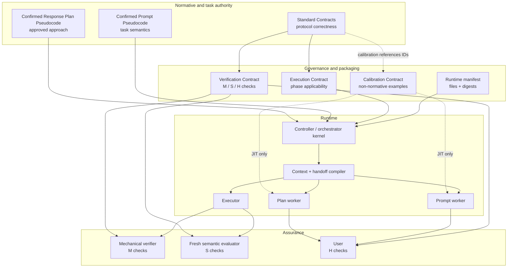

# TRD-0002: Contract substrate and mechanical runtime verification

- Status: Draft for implementation
- Version: 0.1
- Date: 2026-08-07
- Governing decision:
  - [ADR-0007: Contract-governed, context-projected runtime](../adr/0007-contract-governed-context-projected-runtime.md)
- Related decisions:
  - [ADR-0001: Controller-gated pseudocode protocol](../adr/0001-controller-gated-pseudocode-protocol.md)
  - [ADR-0002: Controller-owned artifact controls](../adr/0002-controller-owned-artifact-controls.md)
  - [ADR-0003: Phase-projected single-model contexts](../adr/0003-phase-projected-single-model-contexts.md)
  - [ADR-0004: Confirmed artifacts as execution boundary](../adr/0004-confirmed-artifacts-as-execution-boundary.md)
  - [ADR-0006: Bounded pre-execution reasoning](../adr/0006-bounded-pre-execution-reasoning.md)
- Baseline controller requirements:
  - [TRD-0001: Controller-gated pseudocode protocol](0001-controller-gated-pseudocode-protocol.md)
- Current behavioral reference:
  - [`confirm-with-pseudocode/SKILL.md`](../../../confirm-with-pseudocode/SKILL.md)
- Runtime package manifest:
  - [`runtime-manifest.json`](../../../runtime-manifest.json)

## 1. Purpose

Define the repository and runtime substrate that shall precede full controller
implementation.

This TRD has two responsibilities:

1. specify the contract-governed context model that later Prompt, Plan,
   Execution, and semantic-conformance workers will consume; and
2. implement the narrow deterministic verification needed immediately to trust
   the current skill package and future handoffs.

The current restructuring intentionally does **not** modify the behavior of
`confirm-with-pseudocode/SKILL.md` and does **not** modify the frozen behavioral
harness. It establishes package integrity, architecture boundaries, safe
installation, and the migration path for later contract extraction.

## 2. Design principle

The architecture separates four questions:

```text
Standards
    WHAT constitutes correct protocol behavior?

Execution Contract
    WHEN and WHERE do requirements apply?

Verification Contract
    HOW is each requirement checked?

Calibration Contract
    WHAT examples improve model performance without defining correctness?
```

The runtime shall additionally preserve task-specific authority through the
confirmed PDL pair:

```text
Confirmed Prompt Pseudocode
    WHAT the user wants

Confirmed Response Plan Pseudocode
    approved high-level HOW
```

No downstream layer may independently redefine either system correctness or
confirmed task semantics.

## 3. Goals

1. Establish one normative home for every protocol requirement.
2. Prevent repository-wide search from becoming an implicit instruction source.
3. Make phase context positively selectable rather than subtractively filtered.
4. Preserve confirmed PDL artifacts verbatim across future handoffs.
5. Separate mechanical, semantic, and human verification mechanisms.
6. Catch partial skill installations before the skill is invoked.
7. Bind runtime verification to exact current package bytes.
8. Keep calibration/examples outside routine runtime context.
9. Preserve public architecture/evaluation material without making it runtime
   instruction context.
10. Provide interfaces that the future controller can adopt unchanged.
11. Support same-model, cross-model, and smaller-worker experiments without
    changing artifact authority.
12. Keep the current behavioral skill and frozen harness unchanged during this
    restructuring phase.

## 4. Non-goals

- Rewrite the current `SKILL.md` in this pass.
- Modify frozen harness cases, judges, rubrics, or results.
- Implement the complete controller UI.
- Implement a generic predicate language.
- Make semantic judgment deterministic.
- Use a semantic evaluator as a hidden third user-confirmation authority.
- Expose private chain-of-thought.
- Make public architecture/evaluation documents private merely to keep them out
  of runtime context.
- Require subagents from any particular provider.
- Claim token savings before comparative measurement.
- Infer machine-verifiable assertions from unconstrained natural-language prose.

## 5. Terminology

| Term | Definition |
|---|---|
| Standard Contract | Normative, model-independent requirements for protocol/runtime correctness. |
| Requirement ID | Stable identifier for one normative requirement. |
| Execution Contract | Non-normative orchestration mapping that determines applicability, phase context, handoff, and verification timing. |
| Verification Contract | Inspectable specification of checks, each mapped to requirements and typed `M`, `S`, or `H`. |
| Calibration Contract | Non-normative examples and failure cards used for model optimization. |
| Runtime manifest | Machine-readable package identity and file-integrity declaration. |
| `M` check | Mechanical deterministic check over machine-addressable inputs. |
| `S` check | Probabilistic semantic conformance evaluation in a projected context. |
| `H` check | User confirmation or review that establishes semantic disposition. |
| Context projection | Positive-inclusion context assembled for one role/phase. |
| Worker | Stateless model invocation with one explicit role. |
| Source binding | Versioned link from an operative artifact clause to external source content. |
| Artifact-entailed drift | Conflict demonstrable directly from confirmed artifact text. |
| Interpretive drift | Potential conflict whose resolution requires choosing unsettled meaning. |

## 6. Authority model

### 6.1 System authority

Standard Contracts shall be the only normative source for model-independent
protocol/runtime correctness.

A controller, worker prompt, verifier, checklist, example, or architecture note
shall not independently introduce a requirement that changes what constitutes
correct protocol behavior.

### 6.2 Task authority

Confirmed PDL artifacts shall define task-specific authority:

1. higher-priority platform, safety, privacy, and permission constraints;
2. confirmed Prompt Pseudocode for task semantics;
3. confirmed Response Plan Pseudocode for high-level approach;
4. source bindings and required task data;
5. phase-role instructions and low-level implementation choices.

The original conversational wording remains provenance but shall not override a
conflicting confirmed artifact after confirmation.

### 6.3 Verification authority

Mechanical facts and semantic authority are different categories.

An `M` check may conclusively establish facts such as:

- a file exists;
- a digest matches;
- an artifact version is exact;
- a structured count equals a declared number.

An `S` check may report possible semantic drift but shall not create user intent.

An `H` check may establish or change semantic authority when the user explicitly
confirms or revises an artifact.

## 7. Target architecture



The current implementation phase builds only the contract/manifest substrate and
mechanical package verifier. Worker isolation, semantic evaluation, and the full
controller remain subsequent work.

## 8. Contract repository model

The intended runtime-facing contract tree is:

```text
runtime/
├── SKILL.md
├── CONTRACT_MANIFEST.json
├── contracts/
│   ├── EXECUTION_CONTRACT.md
│   ├── VERIFICATION_CONTRACT.md
│   ├── CALIBRATION.md
│   └── standards/
│       ├── INSTALLATION_STANDARD.md
│       ├── PROMPT_STANDARD.md
│       ├── RESPONSE_PLAN_STANDARD.md
│       ├── PSEUDOCODE_STANDARD.md
│       ├── EXECUTION_STANDARD.md
│       ├── HANDOFF_STANDARD.md
│       └── CONFORMANCE_STANDARD.md
└── references/
    └── pdl-conventions.md
```

This is a target structure, not a statement that the current skill has already
been migrated.

During transition, the current installable package remains:

```text
confirm-with-pseudocode/
├── SKILL.md
├── agents/
│   └── openai.yaml
└── references/
    ├── evaluation-cases.md
    └── pdl-conventions.md
```

The root [`runtime-manifest.json`](../../../runtime-manifest.json) describes
these current bytes so installation integrity can be verified before contract
extraction changes package layout.

## 9. Standard Contract requirements

### 9.1 Single source of truth

Every normative rule shall exist in exactly one Standard Contract after
migration.

Stable requirement IDs should use a short domain prefix, for example:

```text
INSTALL-01
PROMPT-01
PLAN-01
PDL-01
EXEC-01
HANDOFF-01
CONFORM-01
```

### 9.2 Permitted content

Standards may define:

- required behavior;
- prohibited behavior;
- intrinsic ordering constraints;
- inputs and outputs;
- invariants;
- acceptance conditions;
- model-independent definitions required by the protocol.

### 9.3 Prohibited content

Standards shall not contain:

- provider-specific routing unless intrinsic to the requirement;
- duplicated verification procedures;
- model-specific calibration examples;
- architecture-history discussion;
- stale benchmark results;
- speculative implementation notes.

### 9.4 Change rule

If changing a statement changes what constitutes correct protocol behavior, the
statement belongs in a Standard.

No downstream contract may create a new normative requirement without first
adding the corresponding Standard requirement ID.

## 10. Execution Contract requirements

The Execution Contract shall define known lifecycle/context applicability.

It may map:

```text
INSTALL operation
    -> INSTALLATION_STANDARD

PROMPT phase
    -> PROMPT_STANDARD
    -> PSEUDOCODE_STANDARD

PLAN phase
    -> RESPONSE_PLAN_STANDARD
    -> PSEUDOCODE_STANDARD

EXECUTION phase
    -> EXECUTION_STANDARD
    -> HANDOFF_STANDARD

CONFORMANCE phase
    -> CONFORMANCE_STANDARD
```

The Execution Contract may additionally define:

- worker role;
- required source handles;
- output contract;
- tool-permission projection;
- context to exclude;
- verification timing;
- retry eligibility;
- lifecycle events.

It shall not semantically classify arbitrary user prose in order to invent
requirements. Where applicability genuinely depends on qualitative task meaning,
that selection must be explicit, inspectable, or represented through a typed
capability already established by the system.

## 11. Verification Contract requirements

### 11.1 Typed checks

Every check shall reference one or more Standard requirement IDs and declare a
verification class:

```text
M
    deterministic mechanical verification

S
    probabilistic semantic-conformance evaluation

H
    explicit human confirmation or review
```

Example:

| Check | Requirement | Type | Resolver |
|---|---|---|---|
| Installed digest equals manifest | `INSTALL-04` | `M` | Mechanical verifier |
| Prompt preserves operative exclusions | `PROMPT-07` | `S` | Fresh semantic evaluator |
| Prompt represents intended request | `PROMPT-10` | `H` | User |
| Result preserves confirmed ordering | `EXEC-08` | `S` | Fresh semantic evaluator |
| Artifact digest equals confirmed version | `HANDOFF-05` | `M` | Mechanical verifier |

### 11.2 No requirement creation

A verification item without a corresponding Standard requirement is invalid.

Verification code may implement a requirement. It must not define the
requirement.

### 11.3 Explicit non-mechanical status

A Standard requirement that cannot be mechanically proven shall not be silently
omitted from verification. It shall be classified as `S`, `H`, or explicitly
non-applicable for the current phase.

## 12. Calibration Contract requirements

Calibration material is non-normative.

It may include:

- correct/incorrect execution cards;
- borderline cases;
- observed model-specific failures;
- adversarial mutations;
- dry runs;
- n-shot exemplars;
- optimization/evaluation examples.

Every calibration item should reference the Standard IDs it illustrates.

Calibration shall be excluded from routine runtime context by default.

If removing an example changes what constitutes correctness, the missing rule
must be promoted to a Standard.

## 13. Runtime manifest

### 13.1 Purpose

The runtime manifest is a mechanical package contract for the currently
installable skill.

It exists to prevent failures in which an installer reports success after
copying only `SKILL.md` while omitting required subdirectories or installing
bytes that differ from the reviewed release.

### 13.2 Required fields

Version 1.0 shall include:

```text
manifest_version
package
    name
    source_repository
    source_path
    installation_unit
    recursive_copy_required
    exact_file_set

digest
    algorithm

ignored_entries
required_directories
files[]
    path
    required
    git_blob_sha1
    digest_normalization
```

### 13.3 Digest algorithm

The current manifest uses Git blob SHA-1 because the live GitHub Contents API
already exposes the blob identity for each reviewed runtime file. For text files
stored as LF in Git, the manifest may declare `crlf_to_lf` normalization so a
Windows checkout does not false-fail solely because of working-tree EOL
conversion. Files declared with `none` are verified byte-for-byte:

```text
SHA1("blob " + byte_length + NUL + file_bytes)
```

This digest is used for declared content identity, not for password hashing or
cryptographic signature claims. Normalization is explicit per file and is not a
semantic transformation.

A later package format may migrate to SHA-256 without changing the architectural
boundary.

### 13.4 Exact file set

For the current package, the verifier shall require an exact declared runtime
file set, excluding only explicitly ignored OS/cache artifacts.

A missing declared file or undeclared substantive file is a mechanical failure.

This requirement makes recursive installation verifiable rather than assumed.

## 14. Mechanical verifier

### 14.1 Current implementation

[`scripts/verify_runtime_manifest.py`](../../../scripts/verify_runtime_manifest.py)
shall be a standalone, standard-library-only verifier.

It shall perform only mechanical checks declared by the manifest:

- package directory exists;
- required subdirectories exist;
- declared files exist;
- each declared file has the expected Git blob digest after only its declared
  EOL normalization, if any;
- the package contains no undeclared substantive files when exact-tree mode is
  enabled;
- manifest paths are relative and traversal-safe;
- manifest file entries are unique;
- manifest digest values are syntactically valid.

It shall not evaluate:

- Prompt semantic coverage;
- Plan neutrality;
- execution fidelity;
- meaning of `direct reference` or similar prose;
- evidence quality;
- whether a model's reasoning is appropriate.

### 14.2 Exit contract

The CLI shall return:

- exit code `0` when the package passes;
- exit code `1` when a declared package invariant fails; and
- exit code `2` when the manifest itself cannot be trusted or parsed.

Human output shall begin with one of:

```text
RUNTIME MANIFEST PASS
RUNTIME MANIFEST PASS_WITH_WARNINGS
RUNTIME MANIFEST FAIL
RUNTIME MANIFEST ERROR
```

Machine-readable JSON shall be available through `--json`.

### 14.3 Root selection

By default the verifier shall check `package.source_path` in the repository.

An installer or user may pass an installed directory explicitly:

```text
python scripts/verify_runtime_manifest.py --root <installed-package-directory>
```

The same manifest therefore verifies both reviewed source bytes and copied
installation bytes.

### 14.4 Self-test

`--self-test` shall exercise at least:

1. exact recursive package copy -> pass;
2. missing PDL reference -> fail;
3. modified `SKILL.md` bytes -> fail; and
4. undeclared runtime file -> fail.

These tests are outside the frozen behavioral harness and do not modify it.

## 15. Safe installation contract

### 15.1 Agentic installation

An agent installing from the repository shall:

1. acquire the repository or archive into a temporary/local source location;
2. identify the complete `confirm-with-pseudocode/` directory;
3. run the runtime manifest verifier against the source package;
4. copy the complete directory recursively into the host's skill directory;
5. run the same verifier against the installed directory;
6. report the exact installed path and verification result; and
7. not invoke the skill until verification passes.

An installer that can copy only a single file shall stop and report that it
cannot perform a verified installation.

### 15.2 Manual installation

Manual instructions shall prefer a locally materialized repository/archive
followed by an explicit recursive directory copy and post-copy verification.

Documentation shall not imply that downloading or installing only `SKILL.md` is
sufficient.

### 15.3 Network fallback

The runtime skill itself continues to require its local PDL reference and must
not fetch a missing replacement at execution time.

Installation repair and runtime behavior are distinct operations. A failed
installation must be fixed before the skill is used.

## 16. Source-bound semantics

### 16.1 Problem

Exact PDL text can still be semantically incomplete when a clause delegates
meaning to external source material.

Example:

```text
IMPLEMENT all requirements in section 4
```

Passing that clause verbatim without section 4 does not preserve operative
semantics.

### 16.2 Requirement

A future canonical handoff shall either:

- include the operative delegated content; or
- bind the clause to a source handle with stable identity and selector.

Conceptually:

```text
artifact_clause: P17
source_binding:
    handle_id: specification-v3
    selector: section-4
    content_digest: <digest>
```

Every worker whose decision depends on P17 shall receive access to the same
bound content/version.

## 17. Future context-projected worker contracts

### 17.1 Prompt worker

Include:

- authoritative current request and accepted semantic corrections;
- applicable Prompt and PDL Standards;
- only source bindings required to interpret the request;
- Prompt artifact output contract.

Exclude:

- Plan Standards;
- executor/judge instructions;
- substantive findings;
- rejected artifacts;
- architecture history;
- calibration unless explicitly activated.

### 17.2 Plan worker

Include:

- confirmed Prompt artifact verbatim;
- applicable Plan and PDL Standards;
- required output-mode capabilities.

Exclude:

- full conversation when the confirmed Prompt is sufficient;
- task research;
- candidate findings;
- semantic-judge rubric;
- rejected Prompt versions.

### 17.3 Executor

Include:

- confirmed Prompt verbatim;
- confirmed Plan verbatim;
- selected output mode;
- applicable Execution/Handoff Standards;
- required source handles;
- tools and permissions;
- explicit authorized `M` output assertions when present.

Exclude:

- correction/confirmation chatter;
- rejected artifacts;
- calibration material by default;
- prior judge conclusions on the first attempt.

### 17.4 Semantic evaluator

Include:

- confirmed Prompt verbatim;
- confirmed Plan verbatim;
- candidate result;
- applicable `S` checks from the Verification Contract;
- concise observable provenance/evidence handles.

Exclude:

- executor private reasoning;
- complete conversation history;
- prior judge results during the first evaluation;
- irrelevant source/tool transcripts.

## 18. Semantic conformance and remediation

The semantic evaluator remains probabilistic.

Findings shall distinguish:

### 18.1 Artifact-entailed drift

Conflict can be demonstrated directly from confirmed text.

Examples:

- confirmed primary ordering is replaced with a different primary grouping;
- an explicitly required criterion is omitted;
- a forbidden output type is used.

One bounded automatic retry may be authorized without changing confirmed
semantics.

### 18.2 Interpretive drift

Resolution would require choosing a meaning not settled by the confirmed
artifacts.

Examples:

- deciding whether `direct reference` means academic citation only or every
  repository mention;
- deciding how qualitative `buzz` should be weighted when no weighting was
  confirmed.

The semantic evaluator may flag this condition but shall not invent replacement
semantics. Material unresolved cases may be disclosed or returned to the user.

Confidence alone shall not convert interpretive drift into artifact authority.

## 19. Controller integration boundary

TRD-0001 remains the baseline controller lifecycle specification.

When the full controller is implemented, it shall consume rather than duplicate
this substrate:

- Standard IDs and contract versions;
- runtime/package manifest state;
- exact artifact IDs, versions, and digests;
- source bindings;
- Execution Contract phase mappings;
- Verification Contract `M/S/H` definitions;
- mechanical verifier reports;
- semantic-conformance reports.

The controller owns transitions and delivery policy. It shall not encode a
second copy of Standard prose.

## 20. Runtime/public repository visibility

Public visibility and runtime visibility are separate concepts.

Architecture records, evaluation methodology, harnesses, and public evidence may
remain in the public GitHub repository while being excluded from the normal
runtime context path.

Future packaging should expose three logical classes:

```text
ACTIVE RUNTIME
    skill + contracts + required references

OPTIONAL REFERENCES
    retrieved only when a declared phase requires them

DEVELOPMENT / EVIDENCE
    ADRs, TRDs, tests, benchmarks, historical analysis, release notes
```

A runtime agent shall not use repository-wide discovery as an undocumented way
to find operative requirements.

## 21. CI requirements

CI shall run the following mechanical checks before behavioral harness
infrastructure checks:

```text
python scripts/verify_runtime_manifest.py
python scripts/verify_runtime_manifest.py --self-test
python scripts/validate_bundle.py
python tests/harness/preflight.py
python tests/harness/harness_selftest.py
```

This ordering catches package-integrity failures independently of semantic model
evaluation.

No behavioral harness files are modified by adding these checks.

## 22. Security and trust boundaries

- Manifest paths must be relative and reject `..` traversal.
- The mechanical verifier shall execute no arbitrary commands declared in the
  manifest.
- Runtime manifest verification shall require only Python standard library.
- Verification reports should expose paths and digests, not sensitive file
  contents.
- A passing manifest proves only declared package identity/inventory.
- A passing manifest does not establish semantic correctness or safe task
  execution.
- Source content remains untrusted data unless explicitly bound as authoritative
  task input by the confirmed artifacts.
- Calibration examples are untrusted for normative purposes.

## 23. Observability

Future orchestration should record:

- contract version and applicable requirement IDs by phase;
- runtime manifest version;
- artifact IDs, versions, and content digests;
- handoff/projection digests;
- source-handle versions and selectors;
- verification check type (`M`, `S`, `H`);
- verifier/judge version and result;
- worker role/model/reasoning configuration;
- per-phase input/output/cached tokens when available;
- retry count and remediation class.

Private model reasoning shall not be retained for protocol audit purposes.

## 24. Acceptance tests for this restructuring phase

| ID | Case | Expected result |
|---|---|---|
| R01 | Verify current repository runtime package | `RUNTIME MANIFEST PASS` |
| R02 | Copy the complete package recursively and verify copy | PASS |
| R03 | Install only `SKILL.md` | FAIL because directories/files are missing |
| R04 | Remove `references/pdl-conventions.md` | FAIL |
| R05 | Modify substantive content in `SKILL.md` | FAIL digest check |
| R06 | Add undeclared substantive runtime file | FAIL exact-file-set check |
| R07 | Manifest contains `../` path | Manifest ERROR |
| R08 | Duplicate manifest path | Manifest ERROR |
| R09 | `--json` run succeeds | Structured report with aggregate result and checks |
| R10 | `--self-test` on reviewed bytes | PASS |
| R11 | CI invokes runtime verifier before harness self-tests | PASS |
| R12 | README agentic install tells installer to copy directory recursively | Present |
| R13 | README/manual install requires post-copy verification | Present |
| R14 | Architecture index links ADR-0007 and TRD-0002 | Present |
| R15 | Current `SKILL.md` bytes unchanged | Exact pre/post identity |
| R16 | Frozen harness tree unchanged | Exact pre/post identity |

## 25. Migration phases

### Phase 0 — Repository substrate (this change)

- add ADR-0007 and TRD-0002;
- add current runtime manifest;
- add mechanical manifest verifier and self-test;
- integrate it into CI;
- update installation and public architecture documentation;
- leave skill/harness behavior unchanged.

### Phase 1 — Standard extraction

- inventory current `SKILL.md` normative statements;
- assign stable requirement IDs;
- extract Standards without changing behavior;
- retain a compatibility/router `SKILL.md`;
- rerun the frozen behavioral suite after migration.

### Phase 2 — Execution and Verification Contracts

- formalize applicability mappings;
- define typed `M/S/H` checks;
- ensure no downstream contract duplicates Standard definitions;
- add traceability validation.

### Phase 3 — Context-projected baseline

- implement same-model stateless Prompt, Plan, and Execution projections;
- compare against the current conversational baseline;
- measure fidelity, context, cost, and task quality before adding a judge.

### Phase 4 — Semantic conformance

- add fresh same-model `S` evaluator;
- measure seeded-drift precision/recall and ordinary-elaboration false positives;
- compare a cross-model judge;
- adopt bounded remediation only after evidence supports it.

### Phase 5 — Routing optimization

- test smaller Prompt/Plan workers;
- test calibration JIT activation;
- compare same-model and cross-model routing.

### Phase 6 — Full controller/UI

- implement durable canonical state and user-facing artifact controls;
- reuse the validated contracts, manifest, verifier, handoff, and evaluation
  interfaces rather than embedding new copies of policy.

## 26. Release gates

This restructuring may merge without a new model run only if:

- current skill bytes are unchanged;
- frozen harness bytes are unchanged;
- runtime manifest verification passes;
- runtime manifest self-tests pass;
- public bundle validation passes;
- harness preflight/self-tests remain unchanged and pass;
- all relative documentation links resolve.

A later Standard extraction that changes `SKILL.md` or its runtime instruction
path requires behavioral regression testing before being represented as an
equivalent release.

## 27. Open questions

The following are deliberately deferred to implementation evidence:

1. Whether context projection alone removes most post-confirmation drift.
2. Whether a fresh same-model semantic evaluator adds enough detection value to
   justify its cost.
3. Whether cross-model judging materially improves independence or merely
   increases disagreement.
4. Which Standard granularity minimizes context without causing excessive
   routing overhead.
5. Whether calibration cards should be activated by explicit failure-class
   signals, model profile, or evaluation-only configuration.
6. Whether the future runtime package should remain one skill directory or use a
   generated install bundle assembled from contract sources.
7. Whether runtime identity should migrate from Git blob SHA-1 to SHA-256 once
   contract extraction changes the packaging workflow.
